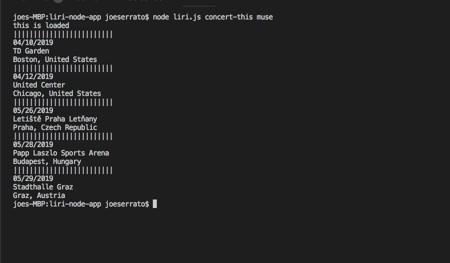
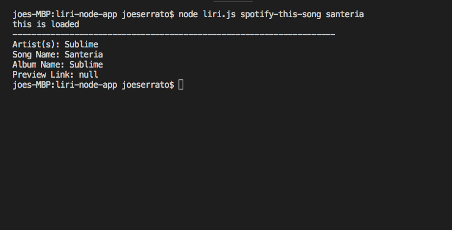
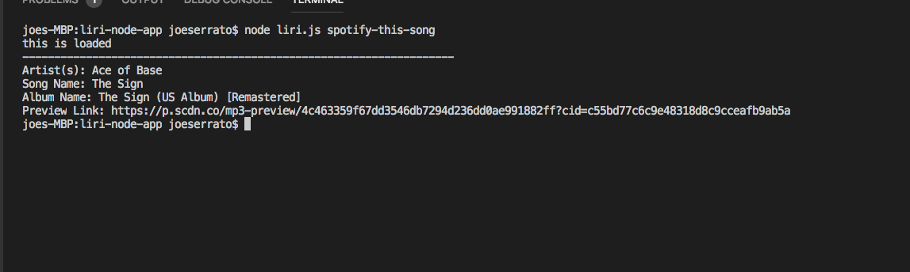
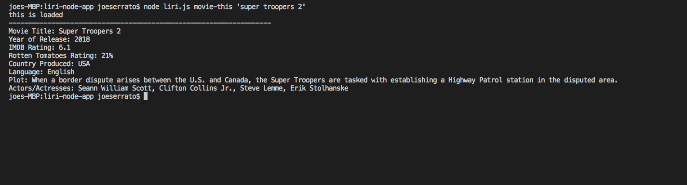
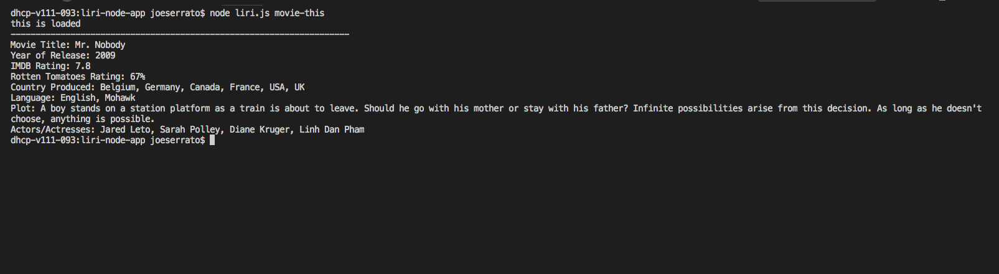
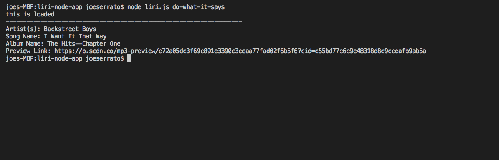

# liri-node-app
### *creator:* Joseph Serrato
### *created On:* 4 10 2019
# About the App
## LIRI is a Language Interpretation and Recognition Interface. LIRI will be a command line node app that takes in parameters and gives you back data. The user has the option to make it so liri.js can take in one of the following commands: (listed Below)

* concert-this

* spotify-this-song

* movie-this

* do-what-it-says

# Instructions
1.Open up Your terminal.
2.Navigate to the folder that contains the liri.js file.
3.Depending on which of the listed above commands you use output may vary.

# For Example 1: Run this command: concert-this

## node liri.js concert-this <artist/band name here>

## what is displayed is a list of 5 of the next upcoming shows for selected artist, if no there is no upcoming shows results will be "undefined".

# Example 2: Run this command: spotify-this-song

## node liri.js spotify-this-song '<song name here>'
  
  ## what is displayed is the first result of the song name inputed.
  
  
  
  ## If user does not input a song name then a default song "The sign" by artist "Ace of Base" will be outputed.
  
  
  
  # Example 3: Run this command: movie-this
  
  ## node liri.js movie-this '<movie name here>'
  
  ## what is displayed is shown below

  

  ## if user does not input a movie name the program will default 'mr.nobody' shown below

  

  # Example 4: Run this command: do-what-it-says

  ## node liri.js do-what-it-says

  ## The system will read the text in the random.txt file, and perform the comman listed in the random.txt file 

  

  
  
  
  
  
  
  
  
  
  
  
  
  